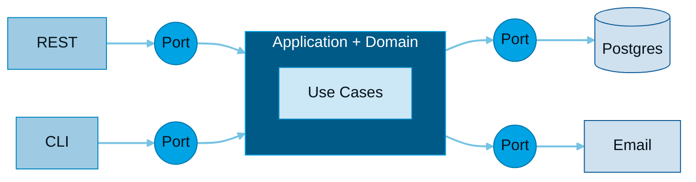
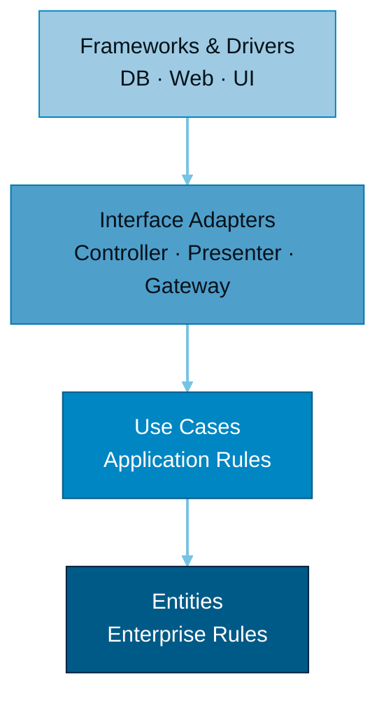

<div class="kicker">สถาปัตยกรรมซอฟต์แวร์ · อธิบายแบบเห็นภาพ</div>

# <span class="grad-hex">Hexagonal</span> <span class="opacity-40 text-3xl">vs</span> <span class="grad-clean">Clean</span>

สองสถาปัตยกรรมแนวเดียวกัน — แยก **business logic** ออกจาก **infrastructure**
และบังคับให้ dependency ชี้เข้าหา core เสมอ · ต่างกันแค่ "มุมมอง" และ "จำนวนชั้น"

<div class="hero-hint pt-8 text-sm opacity-60">
  กด <kbd>Space</kbd> เพื่อเริ่ม →
</div>

<!--
นี่คือ deck เปรียบเทียบ Hexagonal กับ Clean Architecture
แปลงมาจากหน้าเว็บ interactive ArchCompare
-->

---
layout: section
---

<div class="kicker">แก่นที่เหมือนกัน</div>

# ก่อนจะต่าง — มันเหมือนกันตรงไหน?

ทั้งสองแบบเกิดมาเพื่อเป้าหมายเดียวกัน

---

# 3 เสาหลักที่เหมือนกัน

<div class="grid grid-cols-3 gap-6 pt-6">

<v-click>
<div class="ds-card ds-card--hex">
  <div class="text-4xl mb-3">🧩</div>
  <h3 class="c-hex">Core ไม่พึ่ง Framework</h3>
  <p class="text-sm opacity-80 mt-2">เปลี่ยน Postgres → Mongo, REST → gRPC ได้โดยไม่แตะ business logic เลย</p>
</div>
</v-click>

<v-click>
<div class="ds-card ds-card--hex">
  <div class="text-4xl mb-3">🔄</div>
  <h3 class="c-hex">Dependency Inversion</h3>
  <p class="text-sm opacity-80 mt-2">core ประกาศ interface ไว้ ส่วน infrastructure เป็นฝ่ายมา implement ตามสัญญา</p>
</div>
</v-click>

<v-click>
<div class="ds-card ds-card--hex">
  <div class="text-4xl mb-3">🧪</div>
  <h3 class="c-hex">Testable</h3>
  <p class="text-sm opacity-80 mt-2">mock ขอบเขตออกได้ → unit test core ได้โดยไม่ต้องต่อ DB จริง</p>
</div>
</v-click>

</div>

<div v-click class="pt-8 text-center text-sm opacity-60">
ความต่างที่เหลือ คือ <b>"มุมมอง"</b> และ <b>"จำนวนชั้น"</b> เท่านั้น
</div>

---
layout: two-cols
layoutClass: gap-8
---

<div class="kicker c-hex">Ports &amp; Adapters</div>

# Hexagonal

คิดค้นโดย *Alistair Cockburn* (~2005) — โฟกัสที่ **"ขอบ"** ของระบบ core คุยกับโลกภายนอกผ่าน **Port** (สัญญา) และ **Adapter** (ตัว implement)

<v-clicks>

- <b>Driving side</b> (ซ้าย/บน) — ใครเรียกเรา: REST, CLI, Test
- <b>Driven side</b> (ขวา/ล่าง) — เราเรียกใคร: DB, Email, Queue
- เปลี่ยน adapter ได้อิสระ core ไม่รู้เรื่อง
- ไม่บังคับจำนวนชั้นภายใน — ยืดหยุ่นสูง

</v-clicks>

::right::

<div class="pt-16 flex justify-center">



</div>

<div class="text-center text-xs opacity-50 pt-2">driving → core → driven · core เป็นศูนย์กลาง</div>

---
layout: two-cols
layoutClass: gap-8
---

<div class="kicker c-clean">Concentric Layers</div>

# Clean

คิดค้นโดย *Robert C. Martin (Uncle Bob)* (~2012) — รวม Hexagonal + Onion + DDD เป็น **4 ชั้นซ้อนเป็นวงกลม** มี Dependency Rule ที่เข้มงวด

<v-clicks>

- <b>Entities</b> — enterprise business rules (ในสุด)
- <b>Use Cases</b> — application business rules
- <b>Interface Adapters</b> — Controller, Presenter, Gateway
- <b>Frameworks &amp; Drivers</b> — DB, Web, UI (นอกสุด)

</v-clicks>

::right::

<div class="pt-12 flex justify-center">



</div>

<div class="text-center text-xs opacity-50 pt-2">→ dependencies ชี้เข้าด้านในเสมอ · ชั้นในห้ามรู้จักชั้นนอก</div>

---
layout: default
---

<div class="kicker">เทียบกันชัดๆ</div>

# Hexagonal vs Clean

<div class="pt-4">

| ประเด็น | <span class="th-hex">⬡ Hexagonal</span> | <span class="th-clean">◎ Clean</span> |
|---|---|---|
| **มุมมองหลัก** | ขอบเขต in/out | ชั้นซ้อนเป็นวง |
| **โครงสร้าง** | core + ports + adapters (แบน) | 4 ชั้นชัดเจน |
| **ความละเอียดที่กำหนด** | น้อย — ยืดหยุ่น | มาก — opinionated |
| **คำศัพท์เด่น** | Port, Adapter, Driving/Driven | Entity, Use Case, Presenter |
| **เส้นโค้งการเรียนรู้** | เบากว่า เริ่มง่าย | มีกฎเยอะกว่า |
| **เหมาะกับ** | เริ่มเบาๆ ปรับเอง | ทีมใหญ่ อยากมีแบบแผนชัด |

</div>

<div v-click class="ds-quote pt-6 italic opacity-90">
"Clean Architecture คือการ <b>รวม</b> Hexagonal, Onion, DCI, BCE เข้าด้วยกัน"
<div class="text-sm opacity-60 not-italic pt-1">— Robert C. Martin · มองได้ว่า Clean เป็น superset ของ Hexagonal</div>
</div>

---
layout: section
---

<div class="kicker">หัวใจของทั้งสองแบบ</div>

# Dependency Rule

สลับ Adapter ได้ · Core ไม่สะเทือน

<div class="text-sm opacity-70 pt-2">ลองสลับ database adapter ดู — โค้ดใน core (Use Case) ไม่ต้องแก้แม้แต่บรรทัดเดียว</div>

---

# Core ไม่เปลี่ยน 🔒

<div class="text-sm opacity-60 -mt-2 mb-3">core/usecase.ts — พึ่งแค่ interface ไม่รู้จัก DB จริง</div>

```ts {all|2-4|7-13|11}
// Port (สัญญา) ที่ core ประกาศไว้
interface UserRepo {
  save(u: User): Promise<void>
}

// Use Case — พึ่งแค่ interface
class RegisterUser {
  constructor(private repo: UserRepo) {}

  async exec(u: User) {
    await this.repo.save(u)   // ← ไม่รู้ว่าเบื้องหลังคือ DB อะไร
  }
}
```

<div v-click class="pt-3 text-sm opacity-70">
ต่อไป → สลับ <b>adapter</b> 3 แบบ โดยที่โค้ดด้านบนนี้ <b>ไม่ถูกแตะเลย</b>
</div>

---

# 🔁 เปลี่ยนได้ตรง Adapter

ทั้ง 3 implement `UserRepo` ตัวเดิม — เปลี่ยนแค่บรรทัด composition root

<div class="grid grid-cols-3 gap-3 pt-3 text-xs">

<div>
<div class="c-hex mb-1">🐘 infra/postgres.ts</div>

```ts {none|all}
class PgUserRepo
  implements UserRepo {
  async save(u: User) {
    await sql`
      INSERT INTO users ${u}`
  }
}

new RegisterUser(
  new PgUserRepo())
```
</div>

<div>
<div class="c-hex mb-1">🍃 infra/mongo.ts</div>

```ts {none|all}
class MongoUserRepo
  implements UserRepo {
  async save(u: User) {
    await db
      .collection('users')
      .insertOne(u)
  }
}
new RegisterUser(
  new MongoUserRepo())
```
</div>

<div>
<div class="c-hex mb-1">🧠 infra/memory.ts</div>

```ts {none|all}
class InMemoryUserRepo
  implements UserRepo {
  users: User[] = []
  async save(u: User) {
    this.users.push(u)
  }
}
// test ไม่ต้องต่อ DB
new RegisterUser(
  new InMemoryUserRepo())
```
</div>

</div>

<div v-click class="pt-4 text-center text-sm opacity-80">
ใช้ in-memory ตอนเทสต์, Postgres/Mongo ตอน production — <b>core เดิมทุกบรรทัด</b>
</div>

---
layout: section
---

<div class="kicker">Port · Use Case · Adapter</div>

# Pattern เดียวกัน · 5 ภาษา

โค้ดชุดเดียวกัน เขียนในแต่ละภาษา — "กลไก inject dependency" ต่างกัน แต่แนวคิดเหมือนกันเป๊ะ

---

# TypeScript

```ts {all|2-4|7-12|15-19}
// Port — สัญญาที่ core ประกาศ
interface UserRepo {
  save(u: User): Promise<void>
}

// Use Case — พึ่งแค่ interface
class RegisterUser {
  constructor(private repo: UserRepo) {}

  async exec(u: User) {
    await this.repo.save(u)
  }
}

// Adapter — ฝั่ง infrastructure
class PgUserRepo implements UserRepo {
  async save(u: User) {
    await sql`INSERT INTO users ...`
  }
}
```

<div class="abs-br m-6 text-xs opacity-70 max-w-sm text-right">
<b>Constructor injection</b> + <code>implements</code> — core รับ <code>UserRepo</code> ผ่าน constructor ไม่รู้จัก class จริง
</div>

---

# Kotlin

```kotlin {all|2-4|7-9|12-16}
// Port
interface UserRepo {
    suspend fun save(u: User)
}

// Use Case — รับ port ทาง constructor
class RegisterUser(private val repo: UserRepo) {
    suspend fun exec(u: User) = repo.save(u)
}

// Adapter
class PgUserRepo : UserRepo {
    override suspend fun save(u: User) {
        // INSERT INTO users ...
    }
}
```

<div class="abs-br m-6 text-xs opacity-70 max-w-sm text-right">
<b>Primary constructor</b> รับ port ตรงๆ — <code>suspend</code> ทำให้ async อยู่ใน signature ของ Port ได้สะอาด
</div>

---

# Go

```go {all|2-4|7-14|17-22}
// Port
type UserRepo interface {
    Save(u User) error
}

// Use Case — ถือ interface ไว้
type RegisterUser struct {
    repo UserRepo
}

func (r RegisterUser) Exec(u User) error {
    return r.repo.Save(u)
}

// Adapter — เข้าเงื่อนไข UserRepo โดยอัตโนมัติ
type PgUserRepo struct{ db *sql.DB }

func (p PgUserRepo) Save(u User) error {
    _, err := p.db.Exec("INSERT INTO users ...")
    return err
}
```

<div class="abs-br m-6 text-xs opacity-70 max-w-sm text-right">
<b>Implicit interface</b> — <code>PgUserRepo</code> ไม่ต้องประกาศว่า implements อะไร แค่มี method ครบก็ใช้เป็น <code>UserRepo</code> ได้
</div>

---

# Java

```java {all|2-4|7-17|20-24}
// Port
interface UserRepo {
    void save(User u);
}

// Use Case
class RegisterUser {
    private final UserRepo repo;

    RegisterUser(UserRepo repo) {
        this.repo = repo;
    }

    void exec(User u) {
        repo.save(u);
    }
}

// Adapter
class PgUserRepo implements UserRepo {
    public void save(User u) {
        // INSERT INTO users ...
    }
}
```

<div class="abs-br m-6 text-xs opacity-70 max-w-sm text-right">
<b>Constructor injection</b> แบบคลาสสิก — มักจับคู่กับ Spring DI แต่ core เป็นแค่ POJO ไม่ผูก framework
</div>

---

# Rust

```rust {all|2-4|7-16|19-25}
// Port
trait UserRepo {
    fn save(&self, u: &User);
}

// Use Case — generic เหนือ port
struct RegisterUser<R: UserRepo> {
    repo: R,
}

impl<R: UserRepo> RegisterUser<R> {
    fn exec(&self, u: &User) {
        self.repo.save(u);
    }
}

// Adapter
struct PgUserRepo;

impl UserRepo for PgUserRepo {
    fn save(&self, u: &User) {
        // INSERT INTO users ...
    }
}
```

<div class="abs-br m-6 text-xs opacity-70 max-w-sm text-right">
<b>Trait + generic</b> — core เป็น generic เหนือ <code>R: UserRepo</code> ได้ zero-cost abstraction (หรือ <code>Box&lt;dyn UserRepo&gt;</code> ถ้าต้องการ runtime dispatch)
</div>

---
layout: section
---

<div class="kicker">ตัวช่วยตัดสินใจ</div>

# แล้วโปรเจกต์คุณควรใช้อันไหน?

3 คำถามสั้นๆ

---

# เช็กลิสต์ตัดสินใจ

<div class="grid grid-cols-2 gap-6 pt-4 text-sm">

<div class="ds-card ds-card--hex">
<h3 class="c-hex mb-3">⬡ เลือก Hexagonal เมื่อ…</h3>
<v-clicks>

- ทีมเล็ก / เริ่มใหม่ / อยากเร็ว
- ชอบยืดหยุ่น ตัดสินใจโครงสร้างเอง
- business logic ปานกลาง เน้น integration หลายระบบ

</v-clicks>
</div>

<div class="ds-card ds-card--clean">
<h3 class="c-clean mb-3">◎ เลือก Clean เมื่อ…</h3>
<v-clicks>

- ทีมใหญ่ / long-lived / คนเข้าออกบ่อย
- อยากมีกฎ/ชื่อ component ชัดทุกชิ้น
- domain rules ซับซ้อนสูงมาก

</v-clicks>
</div>

</div>

<div v-click class="ds-divider pt-6 text-center text-sm opacity-80 border-t mt-6">
💡 ในทางปฏิบัติหลายทีม <b>ผสมกัน</b> — ใช้ Port/Adapter ของ Hexagonal + แบ่งชั้น Use Case/Entity ของ Clean
</div>

---
layout: center
class: text-center
---

# สรุป

<div class="grid grid-cols-2 gap-8 pt-6 text-left max-w-3xl mx-auto">

<div>
<div class="c-hex text-lg font-bold">⬡ Hexagonal</div>
<p class="text-sm opacity-80 mt-1">มองที่ "ขอบ" — Port &amp; Adapter, in/out · ยืดหยุ่น เริ่มง่าย</p>
</div>

<div>
<div class="c-clean text-lg font-bold">◎ Clean</div>
<p class="text-sm opacity-80 mt-1">มองเป็น "ชั้น" — 4 วงซ้อน, Dependency Rule เข้ม · แบบแผนชัด</p>
</div>

</div>

<div class="pt-8 text-base">
แก่นเดียวกัน: <b class="grad-hex">แยก core ออกจาก infra</b> + <b>dependency ชี้เข้าด้านใน</b>
</div>

<div class="pt-10 text-sm opacity-50">
สร้างโดย <b>เด็กดี</b> สำหรับคุณเบิร์ด · KTB / KM<br/>
Hexagonal (A. Cockburn) · Clean Architecture (R. C. Martin) — เนื้อหาเพื่อการเรียนรู้
</div>
