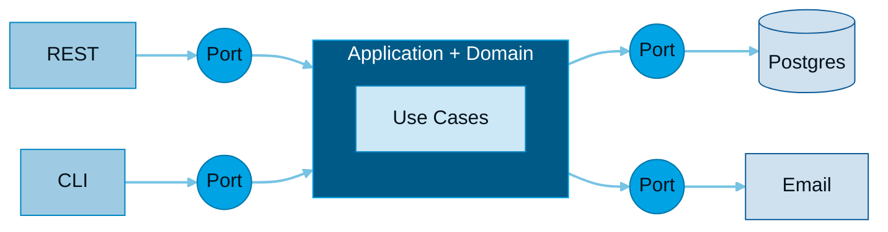
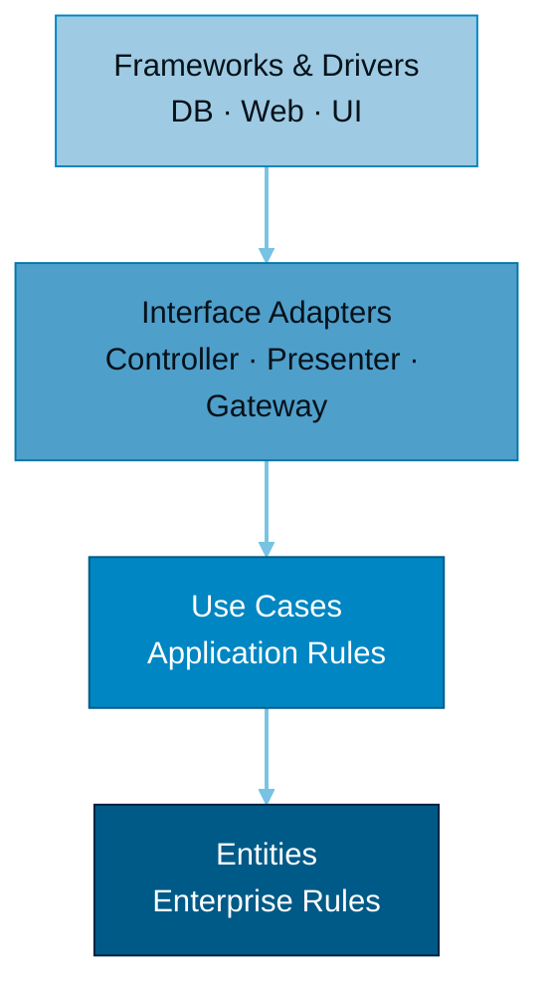
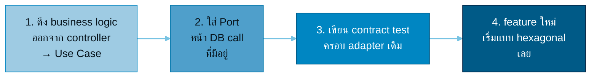

<div class="kicker">สถาปัตยกรรมซอฟต์แวร์ · อธิบายแบบเห็นภาพ</div>

# <span class="grad-hex">Hexagonal</span> <span class="opacity-40 text-3xl">vs</span> <span class="grad-clean">Clean</span>

สองสถาปัตยกรรมแนวเดียวกัน — แยก **business logic** ออกจาก **infrastructure**
และบังคับให้ dependency ชี้เข้าหา core เสมอ · ต่างกันแค่ "มุมมอง" และ "จำนวนชั้น"

<div class="hero-hint pt-8 text-sm opacity-60">
  กด <kbd>Space</kbd> เพื่อเริ่ม →
</div>

<!--
นี่คือ deck เปรียบเทียบ Hexagonal กับ Clean Architecture
แปลงมาจากหน้าเว็บ interactive ArchCompare
-->

---

<div class="kicker c-clean">ทำไมต้องสนใจ</div>

# ปัญหาที่เราเจอบ่อย

<div class="grid grid-cols-3 gap-6 pt-6 text-sm">

<div class="ds-card ds-card--clean">
  <div class="text-3xl mb-2">🍝</div>
  <h3 class="c-clean">Logic ผูกกับ Framework</h3>
  <p class="mt-2">business rule กระจายอยู่ใน controller / ORM — ย้าย framework หรืออัป version ทีแตะทั้งระบบ</p>
</div>

<div class="ds-card ds-card--clean">
  <div class="text-3xl mb-2">🧪</div>
  <h3 class="c-clean">เทสต์ยาก</h3>
  <p class="mt-2">จะ unit test สัก case ต้องต่อ DB จริง / รัน server จริง — ช้า เปราะ คนเลยไม่อยากเขียนเทสต์</p>
</div>

<div class="ds-card ds-card--clean">
  <div class="text-3xl mb-2">🔗</div>
  <h3 class="c-clean">เปลี่ยนของยาก</h3>
  <p class="mt-2">สลับ vendor / DB / message queue ทีกระทบโค้ดธุรกิจเต็มไปหมด ไม่กล้าแตะ</p>
</div>

</div>

<div v-click class="pt-8 text-center">
ทั้ง <b class="c-hex">Hexagonal</b> และ <b class="c-clean">Clean</b> เกิดมาเพื่อแก้ <b>ปัญหาชุดเดียวกันนี้</b>
</div>

<!--
เปิดด้วยความเจ็บปวดที่ทีมเจอจริง ก่อนเข้าทฤษฎี — ให้ทุกคน "อิน" ว่าทำไมต้องฟังต่อ.
ลองถามทีม: เคยเจอ 3 อย่างนี้ไหม? อันไหนเจ็บสุด?
-->

---

<div class="kicker">แผนการนำเสนอ</div>

# วันนี้เราจะคุยอะไรบ้าง

<div class="grid grid-cols-2 gap-x-10 gap-y-2 pt-6 text-base">

<div>1️⃣ แก่นที่เหมือนกัน — 3 เสาหลัก</div>
<div>6️⃣ โค้ดจริง 5 ภาษา</div>
<div>2️⃣ Hexagonal (Ports &amp; Adapters)</div>
<div>7️⃣ เอาไปใช้จริง — โครง · เคส · เทสต์</div>
<div>3️⃣ Clean (Concentric Layers)</div>
<div>8️⃣ กับดัก &amp; trade-offs</div>
<div>4️⃣ เทียบกันชัดๆ</div>
<div>9️⃣ ทีมเราจะใช้อะไร (ADR)</div>
<div>5️⃣ Dependency Rule — สลับ adapter</div>
<div>🔟 Q&amp;A + อ่านต่อ</div>

</div>

<div class="pt-6 text-sm opacity-60">⏱️ ~20–25 นาที + ถาม-ตอบ</div>

<!--
roadmap สั้นๆ ให้ทีมเห็นภาพรวม — จะ pin กลับมาบอกตำแหน่งเป็นระยะ.
ปรับเวลา/ตัดหัวข้อได้ตามรอบประชุม.
-->

---
layout: center
class: text-center
---

<div class="kicker">TL;DR</div>

# ถ้าจำได้แค่ 3 อย่าง

<div class="text-left max-w-2xl mx-auto pt-4 space-y-3 text-lg">

<div>① แยก <b class="c-hex">core (business logic)</b> ออกจาก <b class="c-clean">infrastructure</b> เสมอ</div>
<div>② ให้ <b>dependency ชี้เข้าหา core</b> ผ่าน interface / Port</div>
<div>③ Hexagonal กับ Clean = <b>แนวคิดเดียวกัน</b> ต่างที่ "จำนวนชั้น" และ "ความเข้มของกฎ"</div>

</div>

<div class="pt-8 text-sm opacity-60">ที่เหลือคือรายละเอียดและตัวอย่าง</div>

<!--
บอก take-home ตั้งแต่ต้น (best practice: อย่าให้ audience รอจนจบถึงรู้ประเด็น).
ถ้าใครต้องออกกลางคัน อย่างน้อยได้ 3 ข้อนี้กลับไป.
-->

---
layout: section
---

<div class="kicker">แก่นที่เหมือนกัน</div>

# ก่อนจะต่าง — มันเหมือนกันตรงไหน?

ทั้งสองแบบเกิดมาเพื่อเป้าหมายเดียวกัน

---

# 3 เสาหลักที่เหมือนกัน

<div class="grid grid-cols-3 gap-6 pt-6">

<v-click>
<div class="ds-card ds-card--hex">
  <div class="text-4xl mb-3">🧩</div>
  <h3 class="c-hex">Core ไม่พึ่ง Framework</h3>
  <p class="text-sm opacity-80 mt-2">เปลี่ยน Postgres → Mongo, REST → gRPC ได้โดยไม่แตะ business logic เลย</p>
</div>
</v-click>

<v-click>
<div class="ds-card ds-card--hex">
  <div class="text-4xl mb-3">🔄</div>
  <h3 class="c-hex">Dependency Inversion</h3>
  <p class="text-sm opacity-80 mt-2">core ประกาศ interface ไว้ ส่วน infrastructure เป็นฝ่ายมา implement ตามสัญญา</p>
</div>
</v-click>

<v-click>
<div class="ds-card ds-card--hex">
  <div class="text-4xl mb-3">🧪</div>
  <h3 class="c-hex">Testable</h3>
  <p class="text-sm opacity-80 mt-2">mock ขอบเขตออกได้ → unit test core ได้โดยไม่ต้องต่อ DB จริง</p>
</div>
</v-click>

</div>

<div v-click class="pt-8 text-center text-sm opacity-60">
ความต่างที่เหลือ คือ <b>"มุมมอง"</b> และ <b>"จำนวนชั้น"</b> เท่านั้น
</div>

---
layout: two-cols
layoutClass: gap-8
---

<div class="kicker c-hex">Ports &amp; Adapters</div>

# Hexagonal

คิดค้นโดย *Alistair Cockburn* (~2005) — โฟกัสที่ **"ขอบ"** ของระบบ core คุยกับโลกภายนอกผ่าน **Port** (สัญญา) และ **Adapter** (ตัว implement)

<v-clicks>

- <b>Driving side</b> (ซ้าย/บน) — ใครเรียกเรา: REST, CLI, Test
- <b>Driven side</b> (ขวา/ล่าง) — เราเรียกใคร: DB, Email, Queue
- เปลี่ยน adapter ได้อิสระ core ไม่รู้เรื่อง
- ไม่บังคับจำนวนชั้นภายใน — ยืดหยุ่นสูง

</v-clicks>

::right::

<div class="pt-16 flex justify-center">



</div>

<div class="text-center text-xs opacity-50 pt-2">driving → core → driven · core เป็นศูนย์กลาง</div>

---
layout: two-cols
layoutClass: gap-8
---

<div class="kicker c-clean">Concentric Layers</div>

# Clean

คิดค้นโดย *Robert C. Martin (Uncle Bob)* (~2012) — รวม Hexagonal + Onion + DDD เป็น **4 ชั้นซ้อนเป็นวงกลม** มี Dependency Rule ที่เข้มงวด

<v-clicks>

- <b>Entities</b> — enterprise business rules (ในสุด)
- <b>Use Cases</b> — application business rules
- <b>Interface Adapters</b> — Controller, Presenter, Gateway
- <b>Frameworks &amp; Drivers</b> — DB, Web, UI (นอกสุด)

</v-clicks>

::right::

<div class="pt-12 flex justify-center">



</div>

<div class="text-center text-xs opacity-50 pt-2">→ dependencies ชี้เข้าด้านในเสมอ · ชั้นในห้ามรู้จักชั้นนอก</div>

---
layout: default
---

<div class="kicker">เทียบกันชัดๆ</div>

# Hexagonal vs Clean

<div class="pt-4">

| ประเด็น | <span class="th-hex">⬡ Hexagonal</span> | <span class="th-clean">◎ Clean</span> |
|---|---|---|
| **มุมมองหลัก** | ขอบเขต in/out | ชั้นซ้อนเป็นวง |
| **โครงสร้าง** | core + ports + adapters (แบน) | 4 ชั้นชัดเจน |
| **ความละเอียดที่กำหนด** | น้อย — ยืดหยุ่น | มาก — opinionated |
| **คำศัพท์เด่น** | Port, Adapter, Driving/Driven | Entity, Use Case, Presenter |
| **เส้นโค้งการเรียนรู้** | เบากว่า เริ่มง่าย | มีกฎเยอะกว่า |
| **เหมาะกับ** | เริ่มเบาๆ ปรับเอง | ทีมใหญ่ อยากมีแบบแผนชัด |

</div>

<div v-click class="ds-quote pt-6 italic opacity-90">
"Clean Architecture คือการ <b>รวม</b> Hexagonal, Onion, DCI, BCE เข้าด้วยกัน"
<div class="text-sm opacity-60 not-italic pt-1">— Robert C. Martin · มองได้ว่า Clean เป็น superset ของ Hexagonal</div>
</div>

---
layout: section
---

<div class="kicker">หัวใจของทั้งสองแบบ</div>

# Dependency Rule

สลับ Adapter ได้ · Core ไม่สะเทือน

<div class="text-sm opacity-70 pt-2">ลองสลับ database adapter ดู — โค้ดใน core (Use Case) ไม่ต้องแก้แม้แต่บรรทัดเดียว</div>

---

# Core ไม่เปลี่ยน 🔒

<div class="text-sm opacity-60 -mt-2 mb-3">core/usecase.ts — พึ่งแค่ interface ไม่รู้จัก DB จริง</div>

```ts {all|2-4|7-13|11}
// Port (สัญญา) ที่ core ประกาศไว้
interface UserRepo {
  save(u: User): Promise<void>
}

// Use Case — พึ่งแค่ interface
class RegisterUser {
  constructor(private repo: UserRepo) {}

  async exec(u: User) {
    await this.repo.save(u)   // ← ไม่รู้ว่าเบื้องหลังคือ DB อะไร
  }
}
```

<div v-click class="pt-3 text-sm opacity-70">
ต่อไป → สลับ <b>adapter</b> 3 แบบ โดยที่โค้ดด้านบนนี้ <b>ไม่ถูกแตะเลย</b>
</div>

---

# 🔁 เปลี่ยนได้ตรง Adapter

ทั้ง 3 implement `UserRepo` ตัวเดิม — เปลี่ยนแค่บรรทัด composition root

<div class="grid grid-cols-3 gap-3 pt-3 text-xs">

<div>
<div class="c-hex mb-1">🐘 infra/postgres.ts</div>

```ts {none|all}
class PgUserRepo
  implements UserRepo {
  async save(u: User) {
    await sql`
      INSERT INTO users ${u}`
  }
}

new RegisterUser(
  new PgUserRepo())
```
</div>

<div>
<div class="c-hex mb-1">🍃 infra/mongo.ts</div>

```ts {none|all}
class MongoUserRepo
  implements UserRepo {
  async save(u: User) {
    await db
      .collection('users')
      .insertOne(u)
  }
}
new RegisterUser(
  new MongoUserRepo())
```
</div>

<div>
<div class="c-hex mb-1">🧠 infra/memory.ts</div>

```ts {none|all}
class InMemoryUserRepo
  implements UserRepo {
  users: User[] = []
  async save(u: User) {
    this.users.push(u)
  }
}
// test ไม่ต้องต่อ DB
new RegisterUser(
  new InMemoryUserRepo())
```
</div>

</div>

<div v-click class="pt-4 text-center text-sm opacity-80">
ใช้ in-memory ตอนเทสต์, Postgres/Mongo ตอน production — <b>core เดิมทุกบรรทัด</b>
</div>

---
layout: section
---

<div class="kicker">Port · Use Case · Adapter</div>

# Pattern เดียวกัน · 5 ภาษา

โค้ดชุดเดียวกัน เขียนในแต่ละภาษา — "กลไก inject dependency" ต่างกัน แต่แนวคิดเหมือนกันเป๊ะ

---

# TypeScript

```ts {all|2-4|7-12|15-19}
// Port — สัญญาที่ core ประกาศ
interface UserRepo {
  save(u: User): Promise<void>
}

// Use Case — พึ่งแค่ interface
class RegisterUser {
  constructor(private repo: UserRepo) {}

  async exec(u: User) {
    await this.repo.save(u)
  }
}

// Adapter — ฝั่ง infrastructure
class PgUserRepo implements UserRepo {
  async save(u: User) {
    await sql`INSERT INTO users ...`
  }
}
```

<div class="abs-br m-6 text-xs opacity-70 max-w-sm text-right">
<b>Constructor injection</b> + <code>implements</code> — core รับ <code>UserRepo</code> ผ่าน constructor ไม่รู้จัก class จริง
</div>

---

# Kotlin

```kotlin {all|2-4|7-9|12-16}
// Port
interface UserRepo {
    suspend fun save(u: User)
}

// Use Case — รับ port ทาง constructor
class RegisterUser(private val repo: UserRepo) {
    suspend fun exec(u: User) = repo.save(u)
}

// Adapter
class PgUserRepo : UserRepo {
    override suspend fun save(u: User) {
        // INSERT INTO users ...
    }
}
```

<div class="abs-br m-6 text-xs opacity-70 max-w-sm text-right">
<b>Primary constructor</b> รับ port ตรงๆ — <code>suspend</code> ทำให้ async อยู่ใน signature ของ Port ได้สะอาด
</div>

---

# Go

```go {all|2-4|7-14|17-22}
// Port
type UserRepo interface {
    Save(u User) error
}

// Use Case — ถือ interface ไว้
type RegisterUser struct {
    repo UserRepo
}

func (r RegisterUser) Exec(u User) error {
    return r.repo.Save(u)
}

// Adapter — เข้าเงื่อนไข UserRepo โดยอัตโนมัติ
type PgUserRepo struct{ db *sql.DB }

func (p PgUserRepo) Save(u User) error {
    _, err := p.db.Exec("INSERT INTO users ...")
    return err
}
```

<div class="abs-br m-6 text-xs opacity-70 max-w-sm text-right">
<b>Implicit interface</b> — <code>PgUserRepo</code> ไม่ต้องประกาศว่า implements อะไร แค่มี method ครบก็ใช้เป็น <code>UserRepo</code> ได้
</div>

---

# Java

```java {all|2-4|7-17|20-24}
// Port
interface UserRepo {
    void save(User u);
}

// Use Case
class RegisterUser {
    private final UserRepo repo;

    RegisterUser(UserRepo repo) {
        this.repo = repo;
    }

    void exec(User u) {
        repo.save(u);
    }
}

// Adapter
class PgUserRepo implements UserRepo {
    public void save(User u) {
        // INSERT INTO users ...
    }
}
```

<div class="abs-br m-6 text-xs opacity-70 max-w-sm text-right">
<b>Constructor injection</b> แบบคลาสสิก — มักจับคู่กับ Spring DI แต่ core เป็นแค่ POJO ไม่ผูก framework
</div>

---

# Rust

```rust {all|2-4|7-16|19-25}
// Port
trait UserRepo {
    fn save(&self, u: &User);
}

// Use Case — generic เหนือ port
struct RegisterUser<R: UserRepo> {
    repo: R,
}

impl<R: UserRepo> RegisterUser<R> {
    fn exec(&self, u: &User) {
        self.repo.save(u);
    }
}

// Adapter
struct PgUserRepo;

impl UserRepo for PgUserRepo {
    fn save(&self, u: &User) {
        // INSERT INTO users ...
    }
}
```

<div class="abs-br m-6 text-xs opacity-70 max-w-sm text-right">
<b>Trait + generic</b> — core เป็น generic เหนือ <code>R: UserRepo</code> ได้ zero-cost abstraction (หรือ <code>Box&lt;dyn UserRepo&gt;</code> ถ้าต้องการ runtime dispatch)
</div>

---
layout: section
---

<div class="kicker c-hex">เอาไปใช้จริง</div>

# จากทฤษฎี → โค้ดในโปรเจกต์เรา

โครงโฟลเดอร์ · เคสจริง · กลยุทธ์การเทสต์

---
layout: two-cols
layoutClass: gap-6
---

# โครงโปรเจกต์ — หน้าตาจริง

โครงแบบ Hexagonal/Clean ที่ map ชื่อโฟลเดอร์ตรงกับแนวคิด

```text
src/
├─ domain/              # 🔵 in สุด
│  └─ transfer.ts       #   entity + business rule
├─ application/         # 🔵 use cases
│  ├─ transfer-money.ts #   orchestrate
│  └─ ports/            #   interface (สัญญา)
│     ├─ account-repo.ts
│     └─ ledger.ts
├─ adapters/
│  ├─ driving/          # 🟢 ใครเรียกเรา
│  │  └─ http/transfer.controller.ts
│  └─ driven/           # 🟢 เราเรียกใคร
│     ├─ pg/account-repo.pg.ts
│     └─ kafka/ledger.kafka.ts
└─ main.ts              # composition root
```

::right::

<div class="pt-14 space-y-4 text-sm">

<div class="ds-card ds-card--hex"><b class="c-hex">domain / application</b><p class="mt-1">= core · ไม่ import framework / DB ใดๆ · ที่อยู่ของ business rule ทั้งหมด</p></div>

<div class="ds-card ds-card--hex"><b class="c-hex">ports/</b><p class="mt-1">interface ที่ core ประกาศ — โลกภายนอกต้องทำตามสัญญานี้</p></div>

<div class="ds-card ds-card--clean"><b class="c-clean">adapters/driving · driven</b><p class="mt-1">โค้ดที่ผูกกับ tech จริง (HTTP, Postgres, Kafka) — แตะ/สลับได้โดย core ไม่รู้เรื่อง</p></div>

</div>

<!--
จุดสำคัญ: ชื่อโฟลเดอร์ = ชื่อแนวคิด → คนใหม่เปิดโปรเจกต์แล้วรู้ทันทีว่าอะไรอยู่ตรงไหน.
กฎ lint ง่ายๆ: ห้าม domain/application import จาก adapters/.
-->

---

# เคสจริง — โอนเงิน (Transfer)

business rule อยู่ใน core, I/O อยู่ที่ขอบ

```ts {all|2-4|7-9|11-13|15-17}
// application/transfer-money.ts — Use Case (core)
class TransferMoney {
  constructor(private accounts: AccountRepo, private ledger: Ledger) {}

  async exec(from: string, to: string, amount: Money) {
    const src = await this.accounts.find(from)
    if (src.balance < amount)            // ← business rule อยู่ใน core
      throw new InsufficientFunds(from)

    src.debit(amount)                    // ← domain method
    await this.accounts.save(src)

    await this.ledger.record(from, to, amount)  // ← ผ่าน Port
  }
}
```

<div class="grid grid-cols-3 gap-3 pt-3 text-xs text-center">
<div class="ds-card ds-card--clean">🌐 <b>driving</b><br/>HTTP controller เรียก <code>exec()</code></div>
<div class="ds-card ds-card--hex">🔵 <b>core</b><br/>เช็คยอด + ตัดเงิน (ไม่รู้จัก DB)</div>
<div class="ds-card ds-card--clean">🗄️ <b>driven</b><br/>Postgres + Kafka ทำตาม Port</div>
</div>

<!--
ชี้ให้เห็น: เงื่อนไข "ยอดไม่พอ" อยู่ใน use case ไม่ใช่ใน controller/SQL.
ถ้าย้ายไป gRPC หรือเปลี่ยน DB — โค้ดก้อนนี้ไม่แตะเลย. นี่คือคุณค่าที่จับต้องได้.
-->

---

# กลยุทธ์การเทสต์

testability คือผลพลอยได้ที่ใหญ่ที่สุด — แบ่งชั้นเทสต์ตามขอบเขต

<div class="grid grid-cols-2 gap-6 pt-2">

<div>

| ระดับ | เทสต์อะไร | adapter |
|---|---|---|
| **Unit** (เยอะสุด) | domain + use case | in-memory |
| **Integration** | driven adapter จริง | Postgres/Kafka (testcontainers) |
| **Contract** | ทุก adapter ตรง Port | ชุดเทสต์เดียว รันทุก impl |
| **E2E** (น้อยสุด) | ทั้ง flow ผ่าน HTTP | ของจริง |

</div>

<div class="space-y-3 text-sm pt-2">
<div class="ds-card ds-card--hex"><b class="c-hex">เทสต์ core เร็วมาก</b><p class="mt-1">in-memory adapter → ไม่ต้องต่อ DB → รันพันเคสในไม่กี่วินาที</p></div>
<div class="ds-card ds-card--hex"><b class="c-hex">Contract test = กันของพัง</b><p class="mt-1">เขียนเทสต์ชุดเดียวกับ Port แล้วรันกับทุก adapter (pg, mongo, memory) — มั่นใจว่าสลับได้จริง</p></div>
</div>

</div>

<!--
โยงกลับเสาหลัก "Testable" ตอนต้น. เน้น contract test — เป็นของที่ทีมมักลืม แต่คือสิ่งที่ทำให้ "สลับ adapter ได้" เป็นจริงไม่ใช่แค่คำโฆษณา.
-->

---
layout: section
---

<div class="kicker c-clean">ของจริงไม่ได้สวยเสมอ</div>

# กับดัก &amp; Trade-offs

ก่อนทีมจะกระโดดใช้ — รู้ราคาที่ต้องจ่าย

---

# Anti-patterns ที่พบบ่อย

<div class="grid grid-cols-2 gap-4 pt-4 text-sm">

<div class="ds-card ds-card--clean"><b>🩸 Anemic core</b><p class="mt-1">business logic หลุดไปอยู่ controller/service ข้างนอก เหลือ entity เป็นแค่ data bag</p></div>

<div class="ds-card ds-card--clean"><b>💧 Port รั่ว (leaky)</b><p class="mt-1">Port คืน ORM entity / DB row ดิบ → core ผูกกับ DB ทางอ้อม เสียจุดประสงค์</p></div>

<div class="ds-card ds-card--clean"><b>🏗️ Over-abstraction</b><p class="mt-1">มี adapter เดียวแต่สร้าง interface + factory + mapper ครบ — boilerplate ท่วม</p></div>

<div class="ds-card ds-card--clean"><b>🔌 Framework ใน core</b><p class="mt-1"><code>import express</code> / annotation ของ framework โผล่ใน domain — มัดติดทันที</p></div>

</div>

<div v-click class="pt-5 text-center text-sm opacity-80">
ตัวชี้วัดสุขภาพ: <b>domain/ import อะไรบ้าง?</b> ถ้าเห็นชื่อ framework/DB = มีกลิ่นแล้ว
</div>

<!--
ทุกข้อนี้คือ "ทำตามฟอร์มแต่ลืมเจตนา". เปิดให้ทีมเล่าว่าเคยเห็นข้อไหนในโค้ดเรา.
-->

---

# เมื่อไหร่ "ไม่ควร" ใช้

<div class="grid grid-cols-2 gap-6 pt-4 text-sm">

<div>
<h3 class="c-clean mb-2">⚠️ overhead อาจไม่คุ้ม</h3>
<v-clicks>

- CRUD app เล็ก / prototype / PoC อายุสั้น
- domain logic บางมาก (แค่ย้ายข้อมูล)
- ทีมเล็กมาก ทุกคนรู้ทั้งระบบอยู่แล้ว
- ต้องส่งเร็วสุดๆ ยังไม่รู้ requirement ชัด

</v-clicks>
</div>

<div>
<h3 class="c-hex mb-2">✅ คุ้มเมื่อ</h3>
<v-clicks>

- domain rule ซับซ้อน / เปลี่ยนบ่อย
- อายุโปรเจกต์ยาว คนเข้าออก
- ต้อง integrate หลายระบบ / หลาย vendor
- ต้องการ test coverage สูงที่ business logic

</v-clicks>
</div>

</div>

<div v-click class="ds-divider pt-5 text-center text-sm opacity-80 border-t mt-5">
ทุก abstraction มีต้นทุน (boilerplate + cognitive) — เริ่ม <b>pragmatic</b> แล้วค่อย refactor เมื่อ domain โต
</div>

<!--
ความซื่อสัตย์ตรงนี้สร้างความน่าเชื่อถือ — ไม่ใช่ silver bullet. ป้องกันทีม over-engineer งานเล็ก.
-->

---

# Migration — adopt ทีละน้อย

ไม่ต้อง rewrite ทั้งระบบ · ใช้ Strangler Fig

<div class="pt-2">



</div>

<div class="pt-3 text-sm opacity-80 text-center">
วัดผล: <b>core test coverage เพิ่ม</b> · เปลี่ยน infra ได้โดยไม่แตะ business logic
</div>

<!--
key message: เปลี่ยนแบบ incremental, feature-by-feature. เริ่มจากจุดที่เจ็บสุดก่อน.
ไม่มีใครได้รับอนุมัติให้ rewrite ทั้งระบบอยู่แล้ว — ขายแนวค่อยเป็นค่อยไป.
-->

---
layout: section
---

<div class="kicker">ตัวช่วยตัดสินใจ</div>

# แล้วโปรเจกต์คุณควรใช้อันไหน?

3 คำถามสั้นๆ

---

# เช็กลิสต์ตัดสินใจ

<div class="grid grid-cols-2 gap-6 pt-4 text-sm">

<div class="ds-card ds-card--hex">
<h3 class="c-hex mb-3">⬡ เลือก Hexagonal เมื่อ…</h3>
<v-clicks>

- ทีมเล็ก / เริ่มใหม่ / อยากเร็ว
- ชอบยืดหยุ่น ตัดสินใจโครงสร้างเอง
- business logic ปานกลาง เน้น integration หลายระบบ

</v-clicks>
</div>

<div class="ds-card ds-card--clean">
<h3 class="c-clean mb-3">◎ เลือก Clean เมื่อ…</h3>
<v-clicks>

- ทีมใหญ่ / long-lived / คนเข้าออกบ่อย
- อยากมีกฎ/ชื่อ component ชัดทุกชิ้น
- domain rules ซับซ้อนสูงมาก

</v-clicks>
</div>

</div>

<div v-click class="ds-divider pt-6 text-center text-sm opacity-80 border-t mt-6">
💡 ในทางปฏิบัติหลายทีม <b>ผสมกัน</b> — ใช้ Port/Adapter ของ Hexagonal + แบ่งชั้น Use Case/Entity ของ Clean
</div>

---

<div class="kicker c-hex">Decision Record</div>

# ทีมเราจะใช้อะไร?

<div class="text-sm opacity-70 -mt-2 mb-3">เทมเพลตแบบ ADR — เติมร่วมกันในห้อง แล้วบันทึกเป็น <code>docs/adr/0001-architecture.md</code></div>

<div class="grid grid-cols-2 gap-4 text-sm">

<div class="ds-card ds-card--clean"><b class="c-clean">📌 Context</b><p class="mt-1">โปรเจกต์ ___ · ทีม ___ คน · domain ซับซ้อนระดับ ___ · ต้อง integrate ___ ระบบ · อายุที่คาดหวัง ___</p></div>

<div class="ds-card ds-card--hex"><b class="c-hex">✅ Decision</b><p class="mt-1">เสนอ: <b>Hybrid</b> — Port/Adapter (Hexagonal) + แบ่งชั้น Use Case/Entity (Clean) เท่าที่ domain ต้องการ</p></div>

<div class="ds-card ds-card--hex"><b class="c-hex">➕ Consequences (บวก)</b><p class="mt-1">เทสต์ core ง่าย · สลับ infra ได้ · onboard คนใหม่เร็วขึ้น (ชื่อชั้นชัด)</p></div>

<div class="ds-card ds-card--clean"><b class="c-clean">➖ Consequences (ลบ)</b><p class="mt-1">boilerplate/mapping เพิ่ม · learning curve · ต้องมีวินัย review กัน leak</p></div>

</div>

<div v-click class="pt-4 text-center text-sm">
<b>Status:</b> <span class="c-clean">Proposed</span> → ทีม vote → <span class="c-hex">Accepted</span> · ทบทวนใหม่ทุก 6 เดือน
</div>

<!--
ส่วนที่เปลี่ยนการนำเสนอเป็น "การตัดสินใจร่วม" — อย่าจบแค่ความรู้ ให้ทีมได้ commit.
เติมช่องว่างสดในห้อง แล้ว assign คนเขียน ADR จริงเป็น action item.
-->

---
layout: center
class: text-center
---

# สรุป

<div class="grid grid-cols-2 gap-8 pt-6 text-left max-w-3xl mx-auto">

<div>
<div class="c-hex text-lg font-bold">⬡ Hexagonal</div>
<p class="text-sm opacity-80 mt-1">มองที่ "ขอบ" — Port &amp; Adapter, in/out · ยืดหยุ่น เริ่มง่าย</p>
</div>

<div>
<div class="c-clean text-lg font-bold">◎ Clean</div>
<p class="text-sm opacity-80 mt-1">มองเป็น "ชั้น" — 4 วงซ้อน, Dependency Rule เข้ม · แบบแผนชัด</p>
</div>

</div>

<div class="pt-8 text-base">
แก่นเดียวกัน: <b class="grad-hex">แยก core ออกจาก infra</b> + <b>dependency ชี้เข้าด้านใน</b>
</div>

<div v-click class="pt-6 text-sm">
👉 <b>Next step:</b> สรุป ADR ของทีม + เลือก 1 feature นำร่องทำแบบ hexagonal
</div>

<div class="pt-8 text-sm opacity-50">
สร้างโดย <b>เด็กดี</b> สำหรับคุณเบิร์ด · KTB / KM<br/>
Hexagonal (A. Cockburn) · Clean Architecture (R. C. Martin) — เนื้อหาเพื่อการเรียนรู้
</div>

---
layout: center
class: text-center
---

<div class="kicker">เปิดวง</div>

# Q&amp;A / Discussion

<div class="text-left max-w-2xl mx-auto pt-4 space-y-2 text-base">

- โค้ดส่วนไหนของเราที่ "เจ็บ" ตรงกับปัญหา 3 ข้อตอนต้น?
- feature ไหนเหมาะเป็นตัวนำร่อง?
- เราพร้อมจ่ายค่า boilerplate แลกกับ testability ไหม?
- มี constraint อะไร (deadline, ทีม, legacy) ที่ต้องชั่งก่อน?

</div>

<div class="pt-8 text-sm opacity-60">เปิดให้ถาม / เห็นต่างได้เต็มที่ 🙌</div>

<!--
อย่าปิดด้วย "thank you" เฉยๆ — ใช้คำถามชวนคุยให้ทีมมีส่วนร่วม.
จดประเด็นที่เถียงกันไว้เป็น input ของ ADR.
-->

---

<div class="kicker">อ่านต่อ</div>

# References &amp; Glossary

<div class="grid grid-cols-2 gap-8 pt-4 text-sm">

<div>
<h3 class="c-hex mb-2">📚 อ่านต่อ</h3>

- Alistair Cockburn — *Hexagonal Architecture* (ต้นฉบับ, 2005)
- Robert C. Martin — *Clean Architecture* (book + blog, 2012)
- Martin Fowler — bliki: *Architecture Decision Record*
- C4 Model — c4model.com (วิธีวาด diagram เป็นชั้น)

</div>

<div>
<h3 class="c-clean mb-2">🔤 Glossary</h3>

- **Port** — interface ที่ core ประกาศ (สัญญา)
- **Adapter** — ตัว implement port ผูกกับ tech จริง
- **Driving / Driven** — ฝั่งเรียกเรา / ฝั่งเราเรียก
- **Composition root** — จุดประกอบ adapter เข้า core
- **ADR** — บันทึกการตัดสินใจเชิงสถาปัตยกรรม

</div>

</div>

<div class="pt-6 text-center text-sm opacity-50">
deck + โค้ดตัวอย่าง: เปิดดูแบบ interactive ได้ที่หน้า ArchCompare
</div>

<!--
ทิ้ง reference ให้คนไปขุดต่อเอง + glossary กันงงศัพท์สำหรับคนที่เพิ่งเริ่ม.
-->

---
layout: center
class: text-center
---

# ขอบคุณครับ 🙏

<div class="pt-4 text-base opacity-80">
<b class="grad-hex">แยก core ออกจาก infra</b> · <b>dependency ชี้เข้าด้านใน</b>
</div>

<div class="pt-6 text-sm opacity-50">เด็กดี · KTB / KM</div>
